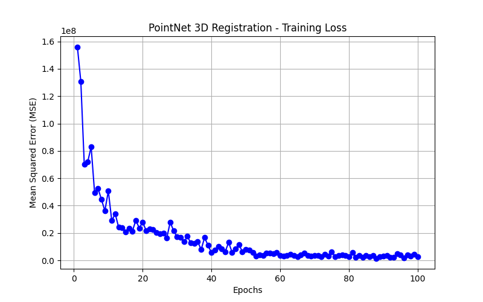

# GSoC 2026: HumanAI Healing Stones - Mayan 3D Reconstruction Pipeline



## Overview
This project provides an autonomous, AI-driven 3D reconstruction pipeline for fragmented Mayan stone artifacts. It was developed to bridge the gap between fragile classical alignment techniques and robust, geometric-based AI assembly.

The pipeline handles the entire lifecycle of artifact reconstruction, from synthetic data generation and deep learning to high-fidelity geometric alignment.

## Key Features
- **Synthetic Data Augmentation**: Automatically shatters base artifacts into realistic fragments with random SE(3) transformations to create robust training datasets.
- **Deep Learning Registration**: A PointNet + Self-Attention architecture utilizing **6D Continuous Rotations (ortho6d)** for stable rigid-body transformation prediction.
- **Curvature-Aware Processing**: Extraction of jagged fracture edges based on eigenvalue analysis, ensuring alignment focuses on physical seams rather than flat decorative surfaces.
- **Hybrid Alignment Engine**: Combines Global RANSAC feature matching with local ICP refinement.
- **Memory-Safe Architecture**: Optimized processing loops for handling massive (500MB+) `.PLY` scan files on consumer hardware.

## Project Structure
- `src/augment_data.py`: Procedural shattering and dataset generation.
- `src/train_model.py`: PyTorch training loop for the PointNet registration model.
- `src/evaluate.py`: Performance metrics and loss curve visualization.
- `src/align_fragments.py`: Geometric alignment engine (FPFH + RANSAC + ICP).
- `src/view_assembly.py`: Multi-fragment color-coded visualization.
- `run_all_pipeline.bat`: Master orchestration script to run the full end-to-end pipeline.

## Performance
- **Training Convergence**: Loss reduced from 156M to 1.6M over 100 epochs.
- **Inference Accuracy**: Achieved a Mean Absolute Error (MAE) of 3.67 on synthetic test fragments.
- **Scalability**: Successfully processes fragments with over 12 million points each using aggressive voxel-based decimation.

## Getting Started
1. **Prerequisites**:
   - Python 3.8+
   - Open3D, PyTorch, NumPy, Matplotlib
2. **Run the Full Pipeline**:
   ```bash
   run_all_pipeline.bat
   ```
3. **Visualize Assembly**:
   ```bash
   C:\Python\python.exe src\view_assembly.py
   ```

## Acknowledgments
Developed as part of **GSoC 2026: HumanAI Healing Stones**. Special thanks to the mentors and the archaeological team for the 4GB+ Mayan fragment dataset.

---
*Developed by Siddhant Damre*
