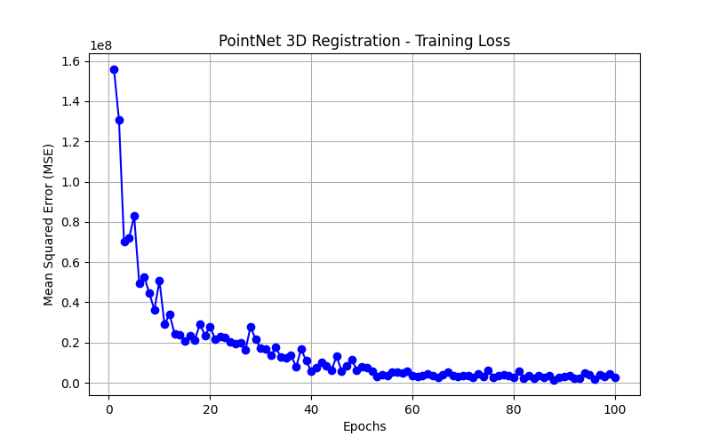

# HumanAI Healing Stones - 3D Artifact Reconstruction Pipeline

[](https://siddhantdamre.github.io/GSoC-2026-HumanAI-Healing-Stones/)
[](https://github.com/Siddhantdamre/Siddhantdamre/blob/main/PORTFOLIO.md)
[](LICENSE)

This project explores AI-assisted reconstruction of fragmented cultural artifacts. It combines synthetic fracture generation, point-cloud learning, and classical geometric alignment to reconstruct Mayan stone fragments from noisy 3D data.



## Recruiter Quick Look

| What to check | Why it matters |
| --- | --- |
| [Live surface](https://siddhantdamre.github.io/GSoC-2026-HumanAI-Healing-Stones/) | Visual overview of the reconstruction workflow. |
| `src/augment_data.py` | Synthetic data generation and shattering pipeline. |
| `src/train_model.py` | PyTorch training loop for point-cloud registration. |
| `src/align_fragments.py` | Hybrid RANSAC + ICP geometric alignment path. |
| `models/training_loss_curve.png` | Evidence of training behavior and experiment tracking. |

## Problem

Archaeological fragments are hard to align because surfaces are damaged, scans are large, and matching by decoration alone can be unreliable. This project treats reconstruction as a hybrid problem: learn useful rigid-body transformations, then refine with geometry-aware alignment.

## Pipeline


```mermaid
flowchart LR
    A[Base 3D artifact] --> B[Synthetic shattering]
    B --> C[Point-cloud augmentation]
    C --> D[PointNet registration model]
    D --> E[Coarse transform prediction]
    E --> F[FPFH + RANSAC]
    F --> G[ICP refinement]
    G --> H[Aligned reconstruction]
```

## Key Features

- Synthetic fragment generation with random SE(3) transforms.
- PointNet-style registration model using stable 6D rotation representation.
- Curvature-aware fracture edge processing to focus on useful alignment geometry.
- Hybrid global RANSAC and local ICP refinement.
- Memory-conscious processing for large `.PLY` scans.

## Results Snapshot

| Metric | Current result |
| --- | --- |
| Training convergence | Loss reduced from 156M to 1.6M over 100 epochs. |
| Synthetic inference | Mean absolute error around 3.67 on test fragments. |
| Scalability target | Large point clouds handled through voxel-based decimation. |

## Project Structure

| Path | Purpose |
| --- | --- |
| `src/augment_data.py` | Procedural shattering and synthetic dataset generation. |
| `src/train_model.py` | PyTorch model training. |
| `src/evaluate.py` | Evaluation and metrics. |
| `src/align_fragments.py` | FPFH, RANSAC, and ICP alignment engine. |
| `src/view_assembly.py` | Color-coded multi-fragment visualization. |
| `run_all_pipeline.bat` | Windows orchestration script for the full pipeline. |

## Run Locally

Install the main dependencies:

```bash
pip install open3d torch numpy matplotlib
```

Run the pipeline on Windows:

```bash
run_all_pipeline.bat
```

Visualize an assembly:

```bash
python src/view_assembly.py
```

## Current Demo State

The GitHub Pages surface explains the pipeline. The next stronger demo is a Three.js viewer with before/after fragment alignment and downloadable sample metrics.

## Roadmap

- Add a browser-based 3D viewer for sample fragments.
- Add screenshots/GIFs of the reconstruction process.
- Add a small synthetic sample dataset for reproducible review.
- Add a notebook that runs a tiny end-to-end pipeline without large scans.

## License

MIT
